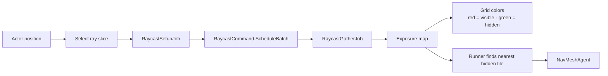

# Unity Deferred Jobs

A Unity prototype for **deferred visibility queries** using the C# Job System, Burst, batched raycasts, and time slicing. It was built after studying Allen Chou's series on [Delayed Result Gathering](https://allenchou.net/2021/05/delayed-result-gathering/) and [Time Slicing](https://allenchou.net/2021/05/time-slicing/).

> [!NOTE]
> The exposure map is a test case only. The goal is to experiment with deferred gathering and time-slicing patterns, not to build a production visibility system.

---

## Overview

An actor scans a grid using raycasts spread across frames. Results feed an exposure map that colors tiles and guides a runner toward the nearest hidden position.

Raycast scheduling and result gathering are deliberately separated by one or more frames, keeping the main thread free while the Job System and Burst handle the work.

---

## Features

- Time-sliced raycast batches
- Deferred result gathering across frames
- Burst-compiled Unity jobs
- Live grid exposure visualization
- Runtime ray-budget slider

---

## Getting Started

Requires Unity `2022.3.62f3`.

1. Open the project in Unity
2. Open `Assets/Scenes/SampleScene.unity`
3. Press Play
4. Left-click a tile to move the actor
5. Use the slider to adjust rays processed per frame

---

## Packages

- [Unity Burst](https://docs.unity3d.com/Packages/com.unity.burst@latest)
- [Unity Jobs](https://docs.unity3d.com/Packages/com.unity.jobs@latest)
- [Unity AI Navigation](https://docs.unity3d.com/Packages/com.unity.ai.navigation@latest)
- [Graphy - stats monitor](https://github.com/Tayx94/graphy)
