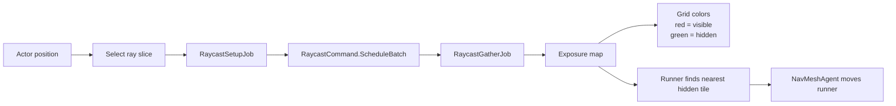

# Unity Deferred Jobs

A basic Unity prototype for **deferred visibility queries** using the C# Job System, Burst, batched raycasts and time slicing.

Built after studying and implementing ideas from Allen Chou's game programming series:

- [Delayed Result Gathering](https://allenchou.net/2021/05/delayed-result-gathering/)
- [Time Slicing](https://allenchou.net/2021/05/time-slicing/)

> [!NOTE]
> The goal is not to build a production exposure-map updater. The exposure map is only a test case for experimenting with these optimization techniques.

## Overview

The project simulates an actor scanning a grid while a runner tries to stay hidden.

Visibility work is processed in small slices. Completed job results update the exposure map, color the grid, and guide the runner toward the nearest hidden tile.

## Features

- Time-sliced raycast batches
- Delayed result gathering across frames
- Burst-compiled Unity jobs
- Grid exposure visualization
- Runtime ray-budget slider

## Run

1. Open with Unity `2022.3.62f3`
2. Open `Assets/Scenes/SampleScene.unity`
3. Press Play
4. Left click a tile to move the actor
5. Use the slider to change rays processed per frame

## Packages

- Unity Burst
- Unity Jobs
- Unity AI Navigation
- [Graphy stats monitor](https://github.com/Tayx94/graphy)
